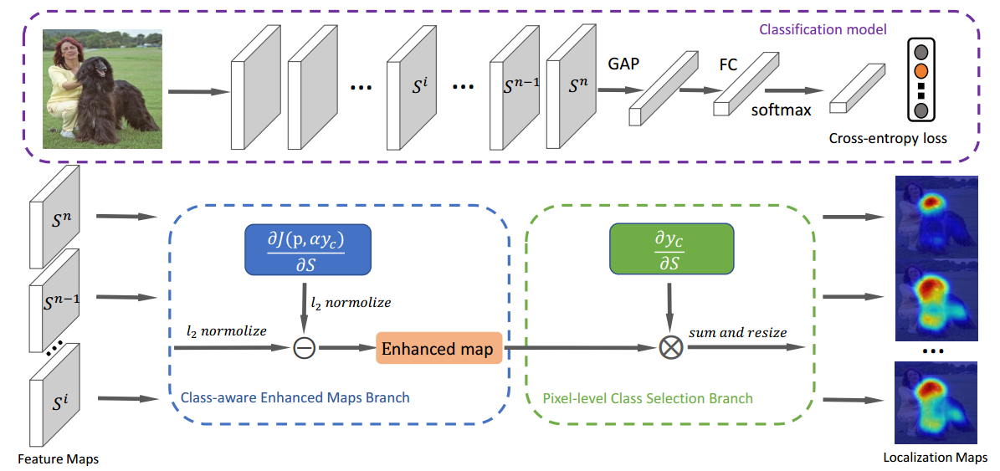
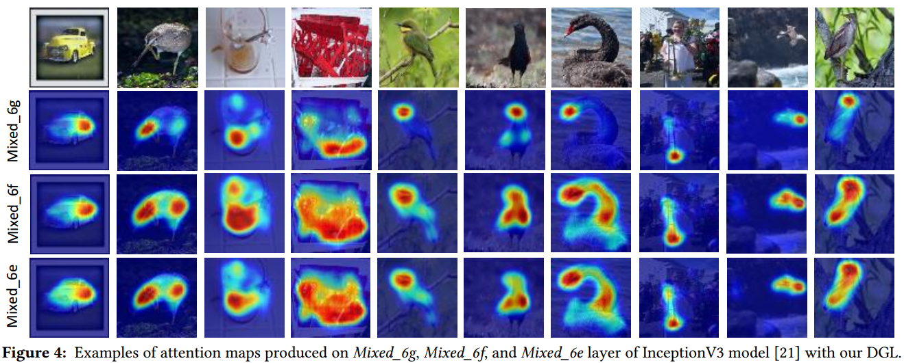

# DGL
Dual-Gradients Localization Framework for Weakly Supervised Object Localization(ACM MM 2020)
In this work, we propose an ofine framework to achieve precise localization on any convolutional layer of a classifcation model by exploiting two kinds of gradients, called Dual-Gradients Localization (DGL) framework. DGL framework is developed based on two branches: 1) Pixel-level Class Selection, leveraging gradients of the target class to identify the correlation ratio of pixels to the target class within any convolutional feature maps, and 2) Class-aware Enhanced Maps, utilizing gradients of classifcation loss function to mine entire target object regions, which would not damage classifcation performance. Extensive experiments on public ILSVRC and CUB-200-2011 datasets show the effectiveness of the proposed DGL framework. 
# Overview

    

# Illustration

    

#TODO

trained model
Prerequisites
